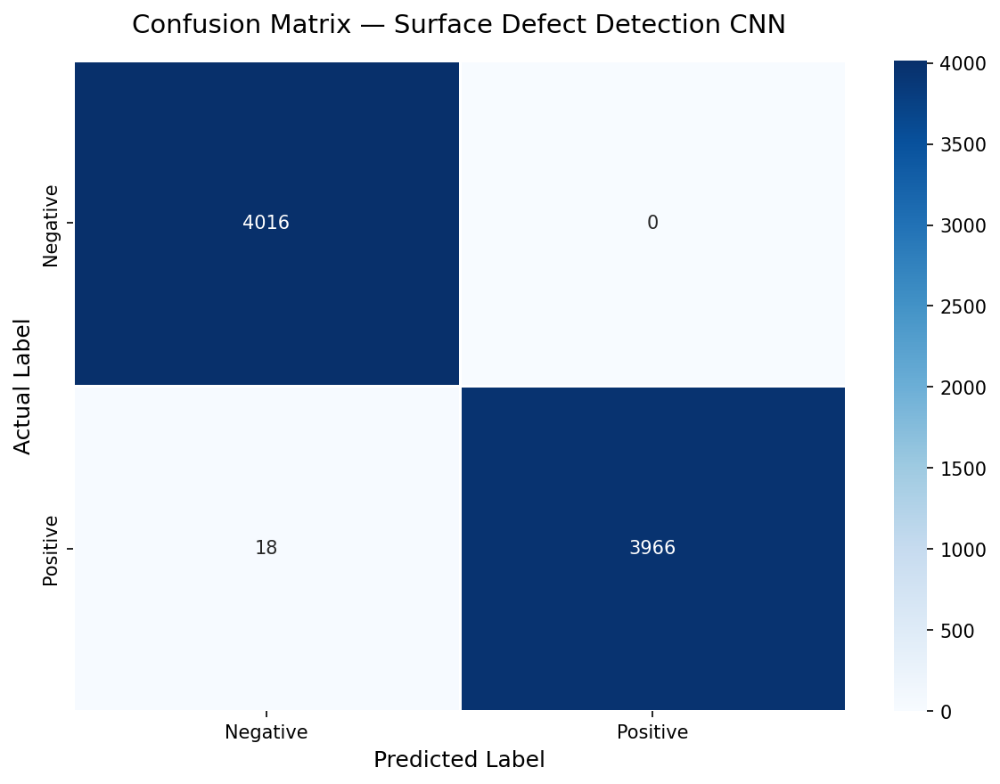

# Automated Material Defect Detection using CNN Architectures

## 📌 Project Overview
In textile and material manufacturing, relying on human visual inspection for quality control introduces significant grading bias and delays. This project implements a Convolutional Neural Network (CNN) architecture using PyTorch to fully automate the classification of surface micro-cracks, ensuring high-speed and highly reliable defect detection.

## 🚀 Key Achievements
* **High Accuracy Classification:** Achieved 99.1% accuracy in detecting structural micro-cracks across a dataset of 40,000 material samples.
* **Latency Reduction:** Reduced processing latency by optimizing the data preprocessing pipeline (implementing automated 128x128 resizing and grayscale channel reduction before tensor conversion).
* **Bias Elimination:** Improved experimental reliability by replacing subjective human visual grading with deterministic mathematical model predictions.

## 🧠 Methodology
1. **Dataset:** Utilized a robust dataset of 40,000 material surface images (20,000 positive for micro-cracks, 20,000 negative/clean). 
2. **Preprocessing:** Images were standardized, resized, and converted to single-channel grayscale to drastically reduce the computational load and improve inference speed.
3. **Model Architecture:** Designed a custom multi-layer CNN with PyTorch, utilizing Conv2d layers for edge and pattern extraction, followed by MaxPooling and ReLU activation functions.
4. **Optimization:** Trained using the Adam optimizer and CrossEntropyLoss over a 80/20 train-test split.

## 📊 Results & Reliability
The model was evaluated against 8,000 unseen test images. The resulting Confusion Matrix demonstrates the model's high reliability and minimal false-negative rate compared to a human baseline.

## 🛠️ Tech Stack
* **Language:** Python
* **AI/ML Framework:** PyTorch, Torchvision
* **Data Manipulation & Visualization:** NumPy, Matplotlib, Seaborn, Scikit-learn
